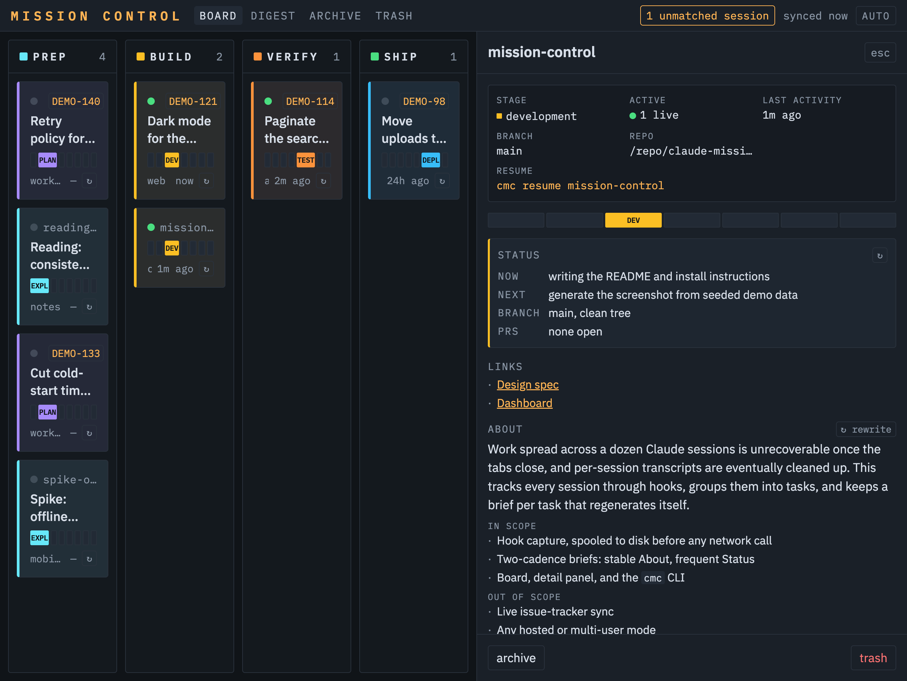

# claude-mission-control

A local dashboard that tracks your Claude Code work across many terminal tabs, and
writes each task a short brief you can resume from days later.

If you run several Claude sessions at once — one per repo, one per ticket — you lose
track of what each was doing the moment you close the tab. Claude's own transcripts
are per-session and eventually cleaned up. This watches every session via hooks,
groups them into **tasks**, and keeps a `BRIEF.md` per task that stays current on its
own. Nothing leaves your machine.



<sub>Generated from `install/seed-demo.sh` — every task, ticket and repo above is
invented. A screenshot of a real board would show real work, so the demo seed is
the only thing this project ever screenshots.</sub>

---

## What it does

**Captures automatically.** Four Claude Code hooks (`SessionStart`, `SessionEnd`,
`UserPromptSubmit`, `Stop`) append every session event to a spool file on disk and
copy transcripts into per-task archives. Disk is written before the server is
contacted, so a dead server never loses capture.

**Groups sessions into tasks.** A session binds to a task explicitly (`/task <name>`),
by an unambiguous repo match, or by a Jira key in your first prompt. It never guesses
when two tasks could match — a wrong attach poisons a brief.

**Writes the brief for you.** A background `claude -p` call distils each task into a
`BRIEF.md`: what the task is, where it stands, what was decided, and where to look.
It regenerates as you work — only the volatile part, so it stays cheap.

**Resumes with context.** `cmc resume <task>` drops you back in the right repo, and
the `SessionStart` hook feeds the brief into the new session automatically.

---

## Requirements

- **macOS.** The background server runs as a launchd agent. Everything else is
  portable; on Linux you'd run the server yourself and register the hooks by hand.
- **Node 20+**, **Claude Code** (`claude` on your PATH and logged in), plus `jq`,
  `curl` and `sqlite3` (all present on macOS except `jq`: `brew install jq`).

---

## Install

```sh
git clone <your-fork-url> claude-mission-control
cd claude-mission-control
sh install/install.sh
```

The installer is idempotent and shows you a diff before touching anything. It:

1. checks your tooling and resolves absolute paths (launchd gets a bare `PATH`),
2. creates the data directory at `~/claude-tasks/`,
3. builds the dashboard,
4. **shows the exact diff to `~/.claude/settings.json` and asks before applying it**
   — it backs the file up first, and answering no just skips hook registration,
5. links the `/task` skill into `~/.claude/skills/`,
6. starts the launchd agent and verifies the server answers,
7. verifies the server can actually invoke `claude` (auto-briefs need this).

Then add the CLI to your shell:

```sh
echo "source $PWD/cli/cmc.sh" >> ~/.zshrc && source ~/.zshrc
```

Open <http://127.0.0.1:47613>.

### Uninstall

```sh
cmcctl stop
launchctl bootout "gui/$(id -u)/com.claude-mission-control.agent"
rm ~/Library/LaunchAgents/com.claude-mission-control.agent.plist
rm ~/.claude/skills/task ~/.local/bin/cmcctl
# then remove the four mc-hook.sh entries from ~/.claude/settings.json
# your data stays in ~/claude-tasks/ until you delete it
```

---

## Daily use

| You want to | Do this |
|---|---|
| Track the session you're in | `/task auth-rate-limit` (in Claude) |
| Bind to an existing task | `/task auth` — substring match, refuses if ambiguous |
| Save a brief right now | `/task` with no argument |
| See everything | `cmc ls`, or the dashboard |
| Resume a task | `cmc resume auth-rate-limit` |
| Read all briefs in the terminal | `cmc digest` |
| Check the server | `cmcctl status` / `cmcctl logs` |

`/task` is fire-and-forget — a single background `curl` that never blocks your
session. On a repo it already recognises, sessions attach on their own and you never
need to type anything.

### The board

Seven stages grouped into four columns — **PREP** (explore, plan), **BUILD**
(development), **VERIFY** (review, testing), **SHIP** (deploy, done). Drag a card
between columns, or click a segment on its stage strip. Drag to the bottom bar to
archive or trash.

### The brief

Each task's `~/claude-tasks/<task>/BRIEF.md` has four sections on two different
cadences, which is what keeps regeneration cheap:

- **About** — why the task exists and what's changing. Stable; rewritten only when
  you press `↻ rewrite`.
- **Status** — Now / Next / Blockers, plus which branch the code is on and how the
  PRs look. Regenerated as you work.
- **Decisions** — choices you might otherwise re-litigate, each with its reason.
- **Invariants** — rules you might break by accident. No reasons, just the rule.

They're plain markdown with YAML frontmatter, so they're greppable and readable
without the server running. Every save keeps the previous version in
`<task>/briefs/`.

---

## Configuration

`~/claude-tasks/.index/config.json`, created by the installer:

| Key | Default | Meaning |
|---|---|---|
| `port` | `47613` | Server port (loopback only) |
| `claudeBin` | resolved | Absolute path to `claude` |
| `briefModel` | `sonnet` | Model used for brief generation |
| `staleMinutes` | `4` | Minimum gap between Status refreshes |
| `jiraBase` | `""` | e.g. `https://your-org.atlassian.net/browse/` to make Jira chips link |
| `unboundRetentionDays` | `30` | How long transcripts with no task are kept |
| `trashRetentionDays` | `30` | How long trashed tasks are recoverable |

Environment overrides: `MC_PORT`, `MC_DATA_DIR`.

---

## How your data is stored

```
~/claude-tasks/
├── <task-slug>/
│   ├── BRIEF.md            # frontmatter + the four sections
│   ├── briefs/             # every previous version
│   └── transcripts/        # session transcripts, copied on SessionEnd
├── _unbound/               # transcripts from sessions with no task
├── _spool/events.jsonl     # append-only hook event log
└── .index/mission-control.db   # SQLite index, rebuildable from the files
```

**The files are the source of truth.** The database is a queryable index and can be
deleted — it rebuilds from the markdown and the spool on next start.

Archiving a task is the one lossy operation: it writes a final self-contained brief
and then deletes that task's transcripts. It will not delete them if that brief
fails to generate.

---

## Privacy and safety

Everything is local. The server binds to `127.0.0.1`, rejects non-loopback callers
and cross-origin mutations, and there is no telemetry or outbound call of any kind.

Brief generation runs `claude -p` on your own Claude subscription. Your transcripts
are passed to it as input — the same data Claude Code already handles — and the
summariser runs with `MC_INTERNAL=1` so it can't recursively trigger the hooks.

Transcripts of your sessions live in `~/claude-tasks/`. If you work on anything
sensitive, that directory deserves the same care as the repos themselves.

---

## Development

```sh
npm install
npm test                      # 121 vitest tests
sh hooks/test/hook.test.sh    # hook contract tests (shell)
npm start                     # run the server in the foreground
cd dashboard && npm run dev   # dashboard with HMR against a running server
sh install/seed-demo.sh       # fill a server with demo tasks for UI work
```

The design docs in `docs/superpowers/` record why things are the way they are,
including several decisions that look arbitrary until you read them.

**Layout:** `server/src/` is the Fastify server and brief generator; `dashboard/src/`
is the React 19 + Tailwind v4 UI; `hooks/mc-hook.sh` is the single capture hook;
`cli/cmc.sh` is the shell CLI; `skills/task/` is the `/task` slash command.

The hook has one hard contract, enforced by its tests: **always exit 0, never block a
session, and never write to stdout** except the deliberate `SessionStart` brief
injection. A hook that breaks makes Claude unusable, so it fails silently by design
and spools to disk when the server is down.

---

## License

MIT
